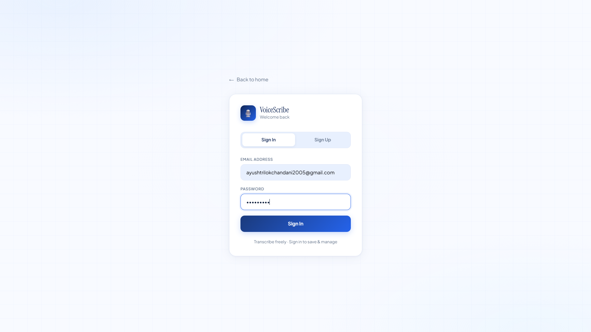
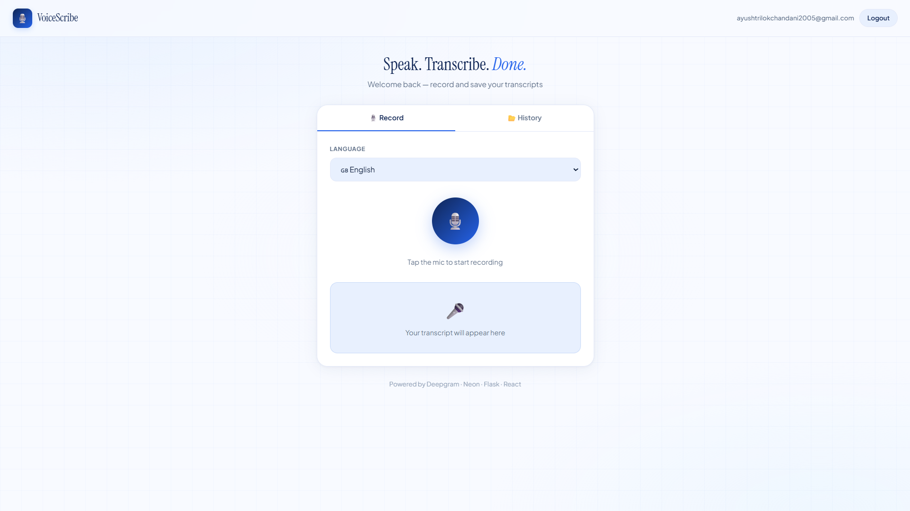
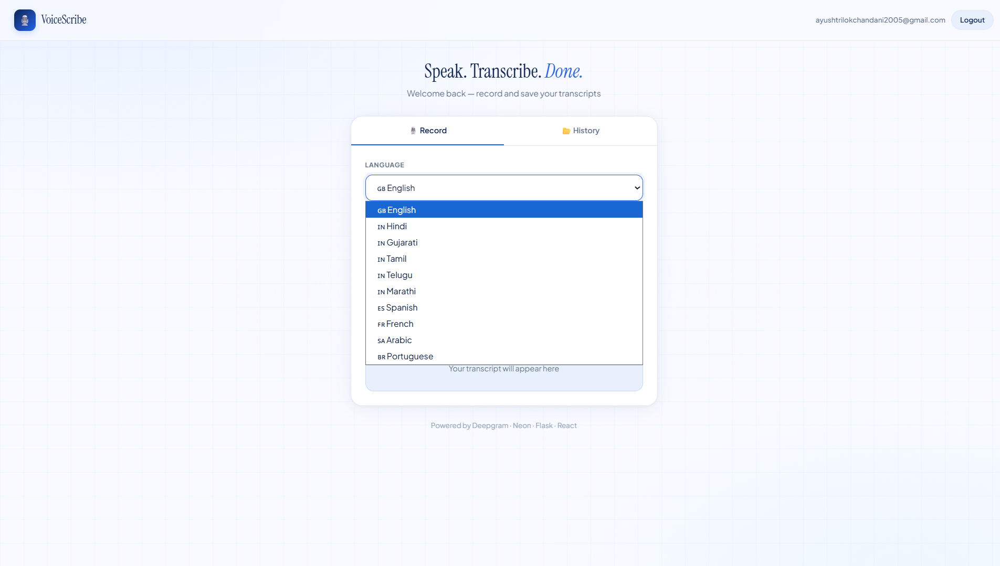
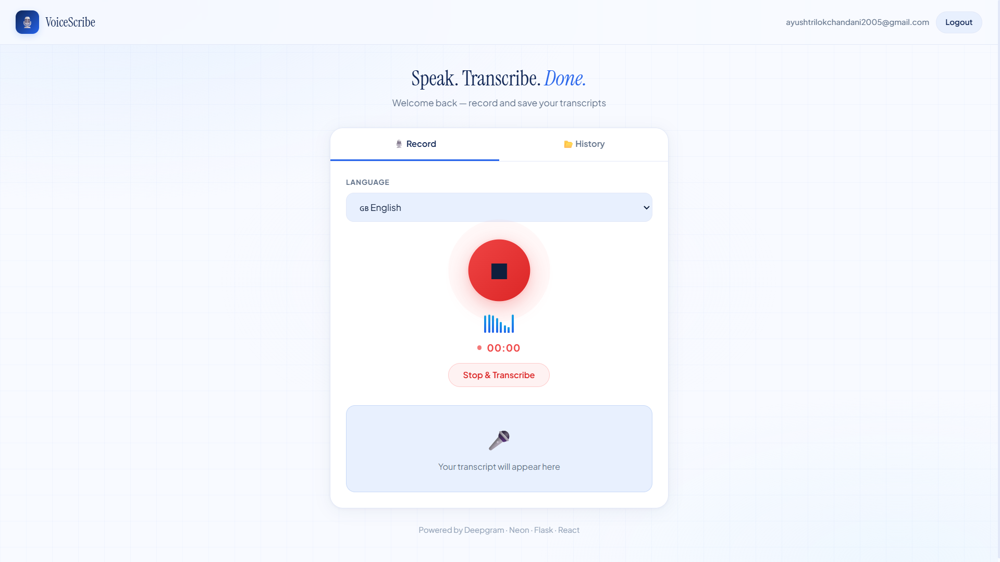
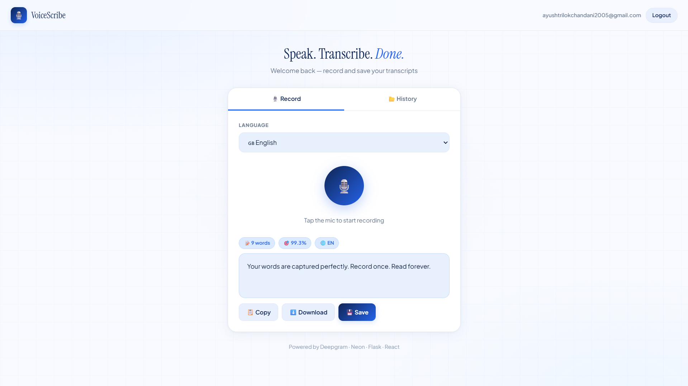
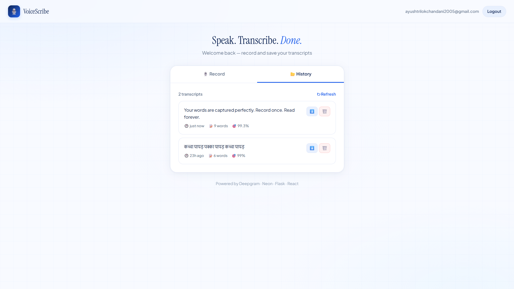

# 🎙️ VoiceScribe — Speech to Text


A full-stack web app that converts spoken audio into accurate text — powered by Deepgram AI. Guests can transcribe freely; registered users can save and manage their transcript history.

---

## 🌐 Live Demo

| | URL |
|---|---|
| 🖥️ Frontend | https://speech-to-text-weld-seven.vercel.app |
| ⚙️ Backend | https://ayushTrilokchandani-speech-to-text.hf.space |
| 🩺 Health | https://ayushTrilokchandani-speech-to-text.hf.space/health |

---

## 📸 Screenshots


| Record | Transcript | History |
|---|---|---|
|  |
|  |
|  |
|  |  |  |

---

## 🛠️ Tech Stack

| Layer | Technology |
|---|---|
| **Frontend** | React 18, Vite, Tailwind CSS |
| **Backend** | Flask, Flask-CORS, PyJWT, bcrypt |
| **Database** | Neon (PostgreSQL) |
| **STT API** | Deepgram |
| **Backend Host** | Hugging Face Spaces |
| **Frontend Host** | Vercel |

---

## ✨ Features

- 🎙️ Record audio directly in the browser — no installs needed
- 🌐 Supports 10+ languages — English, Hindi, Gujarati, Tamil, Telugu, and more
- 🤖 AI transcription with confidence score and word count
- 🔒 JWT authentication — register, login, logout
- 💾 Save transcripts to database (logged-in users only)
- 📂 View, expand, download, and delete transcript history
- 📋 Copy or download any transcript as `.txt`
- 🆓 Freemium — guests transcribe freely, sign in to save

---

## 🏭 Industrial Use Cases

| Industry | Application |
|---|---|
| 🏥 Healthcare | Doctors dictate patient notes hands-free |
| ⚖️ Legal | Transcribe court hearings and depositions |
| 🎓 Education | Convert lectures into searchable text notes |
| 🏢 Corporate | Auto-transcribe meetings and calls |
| 📺 Media | Generate subtitles and podcast show notes |
| ♿ Accessibility | Assist users with hearing or motor disabilities |

---

## 📁 Project Structure

```
voicescribe/
├── backend/
│   ├── app.py          # Flask routes
│   ├── auth.py         # JWT + bcrypt
│   ├── db.py           # PostgreSQL (Neon) queries
│   └── requirements.txt
│
└── frontend/
    └── src/
        ├── components/
        │   ├── AuthForm.jsx
        │   ├── Recorder.jsx
        │   ├── TranscriptPanel.jsx
        │   └── HistoryPanel.jsx
        ├── App.jsx
        └── api.js
```
---

## 📡 API Reference

| Method | Endpoint | Auth | Description |
|---|---|---|---|
| `GET` | `/health` | ❌ | Health check |
| `POST` | `/register` | ❌ | Create account |
| `POST` | `/login` | ❌ | Login, returns JWT |
| `POST` | `/transcribe` | Optional | Transcribe audio |
| `GET` | `/transcripts` | ✅ | Get user's history |
| `DELETE` | `/transcripts/<id>` | ✅ | Delete a transcript |

---

## 🔮 Future Scope

- Real-time streaming transcription via WebSockets
- Export transcripts as PDF or DOCX
- AI summarization of long transcripts
- Speaker diarization (who said what)
- Mobile app (React Native)
- Full-text search across history

---

## 👨‍💻 Author

**Ayush Trilokchandani** — [Hugging Face](https://huggingface.co/ayushTrilokchandani) · [GitHub](https://github.com/ayushTrilokchandani)

---

## 📄 License

MIT License — free to use and modify.

---

<div align="center">
  <p>Made with ❤️ using Flask · React · Deepgram · Neon · Hugging Face</p>
  <p>⭐ Star this repo if you found it helpful!</p>
</div>